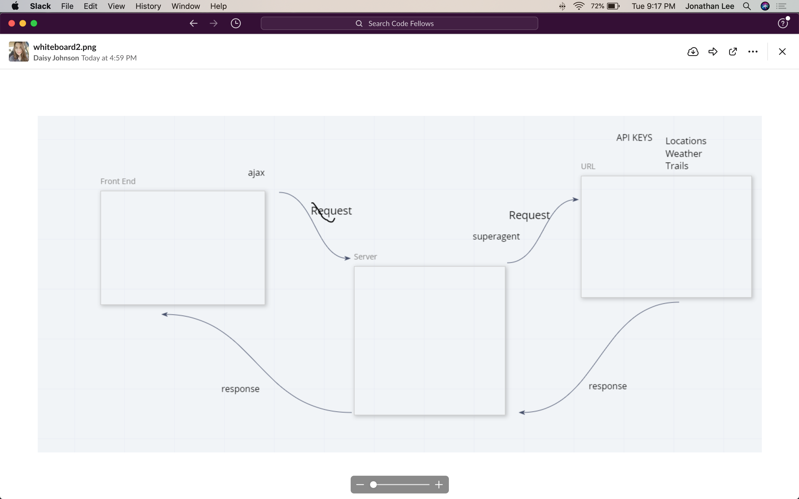

# city_explorer_api

#
Number and name of feature: locations

Estimate of time needed to complete: 2hrs

Start time: 5pm

Finish time: 9pm

Actual time needed to complete: 3hrs

#
Number and name of feature: weather

Estimate of time needed to complete: 3hrs

Start time: 8pm

Finish time: 10pm

Actual time needed to complete: 2hrs

#
Number and name of feature: Errors Alert 

Estimate of time needed to complete: 2hrs

Start time: __6pm___

Finish time: _9pm____

Actual time needed to complete: 3hrs

