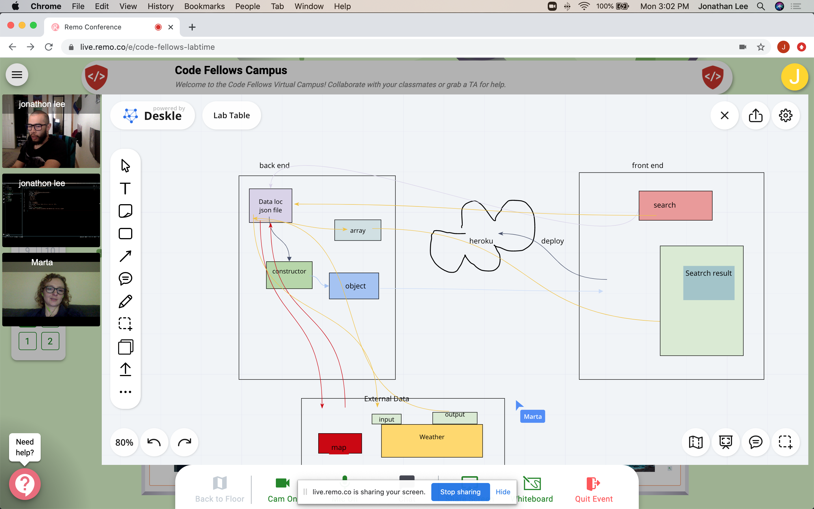
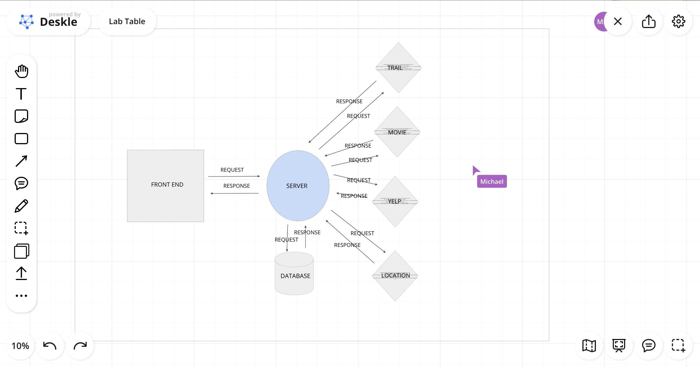

# city_explorer_api

#
Number and name of feature: locations

Estimate of time needed to complete: 2hrs

Start time: 5pm

Finish time: 9pm

Actual time needed to complete: 3hrs

#
Number and name of feature: weather

Estimate of time needed to complete: 3hrs

Start time: 8pm

Finish time: 10pm

Actual time needed to complete: 2hrs

#
Number and name of feature: Errors Alert 

Estimate of time needed to complete: 2hrs

Start time: 6pm

Finish time: 9pm

Actual time needed to complete: 3hrs

#
Number and name of feature: SQL database

Estimate of time needed to complete: 4hr

Start time: 1:42pm

Finish time: 11pm

Actual time needed to complete: 9hrs

#
Number and name of feature: Movies and Yelp

Estimate of time needed to complete: 2hr

Start time: 2:30pm

Finish time: 

Actual time needed to complete: 

